# 视觉验收包

## 当前结论

- UI 状态：合格
- 是否达到老板可分享标准：是
- 是否达到每日自用标准：是
- 最大问题：当前线上真实日报仍取决于用户配置 OpenAI API Key 和 OPENAI_MODEL；截图内容为验收样例数据。
- 最大改进：已从基础静态页重构为深色 executive dashboard，首页、报告、归档、搜索、加密解锁和移动端都有完整可视状态。

## 页面截图

- 首页桌面：`docs/visual-audit/desktop-home.png`

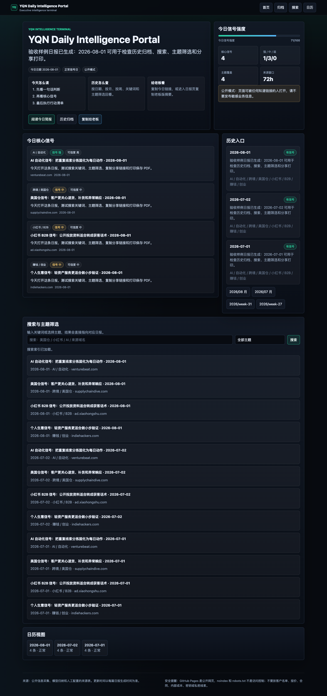

- 报告页桌面：`docs/visual-audit/desktop-report-2026-07-01.png`

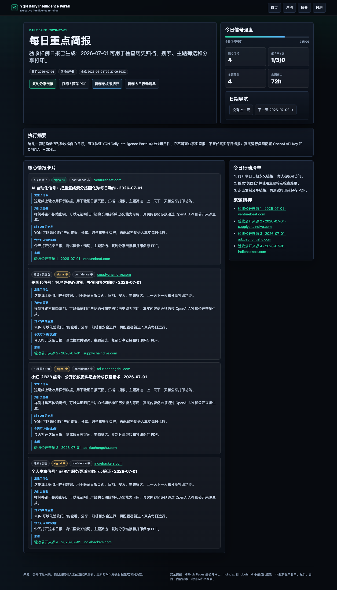

- 第二个报告页桌面：`docs/visual-audit/desktop-report-2026-07-02.png`

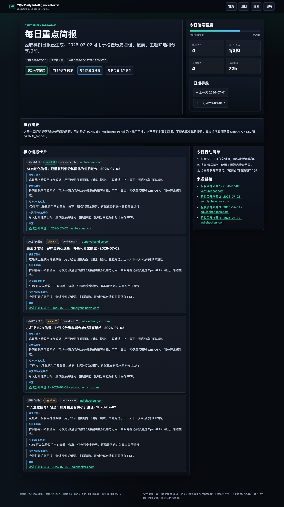

- 归档页桌面：`docs/visual-audit/desktop-archive.png`

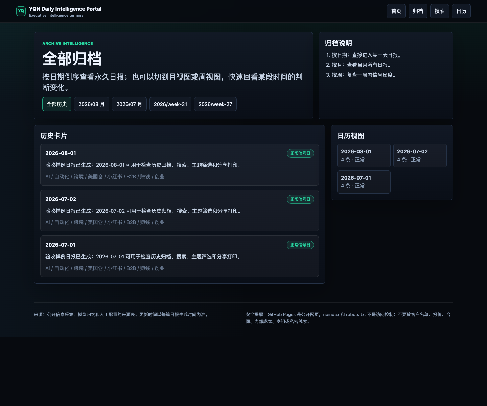

- 月归档：`docs/visual-audit/desktop-month-2026-07.png`

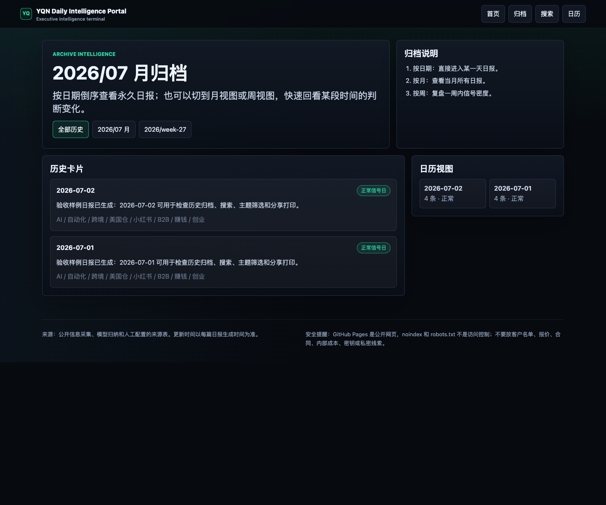

- 周归档：`docs/visual-audit/desktop-week-2026-W27.png`

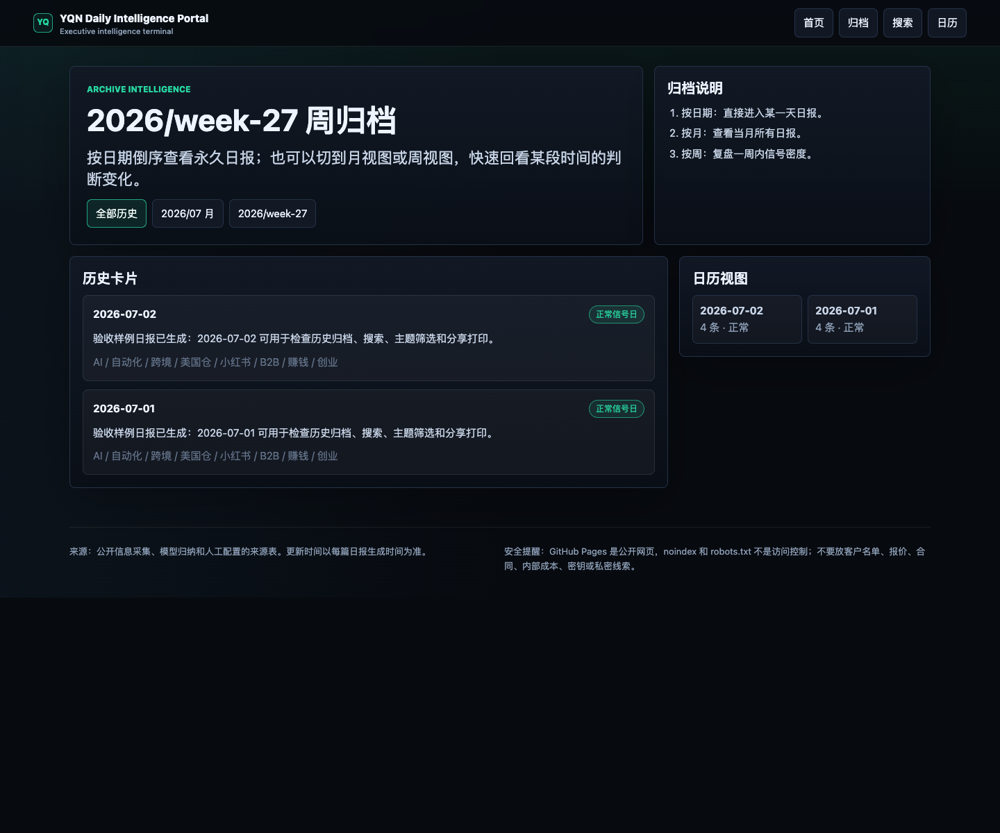

- 搜索有结果：`docs/visual-audit/desktop-search-results.png`

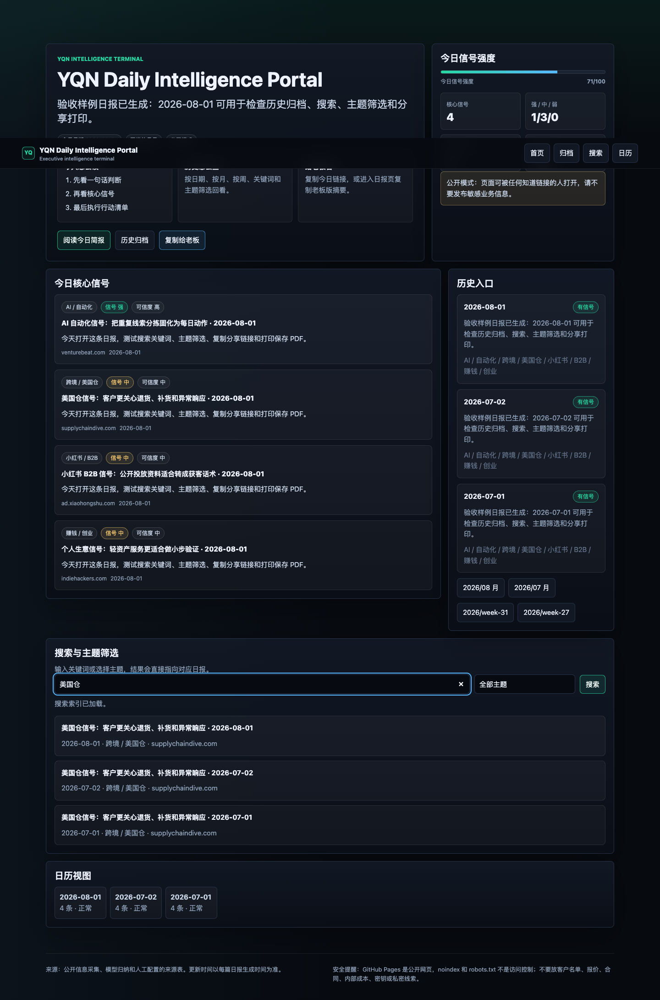

- 搜索无结果：`docs/visual-audit/desktop-search-empty.png`

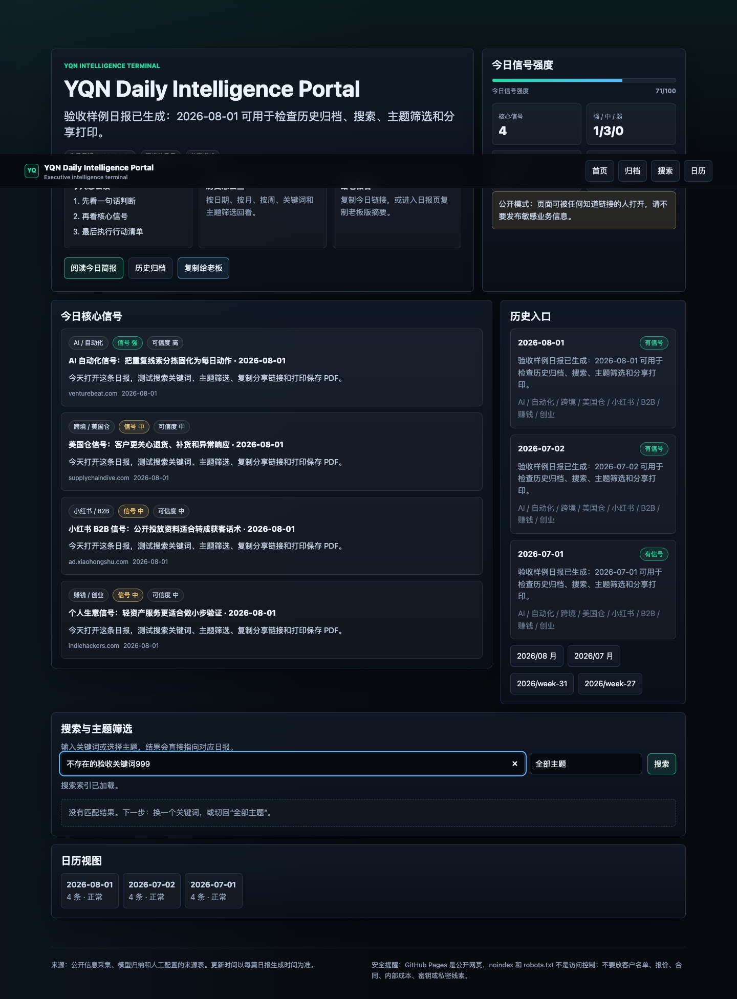

- 主题筛选：`docs/visual-audit/desktop-topic-filter.png`

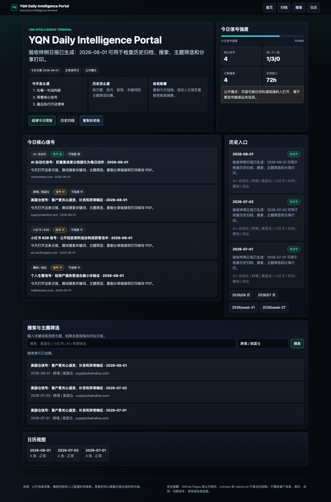

- 加密锁定：`docs/visual-audit/desktop-encrypted-locked.png`

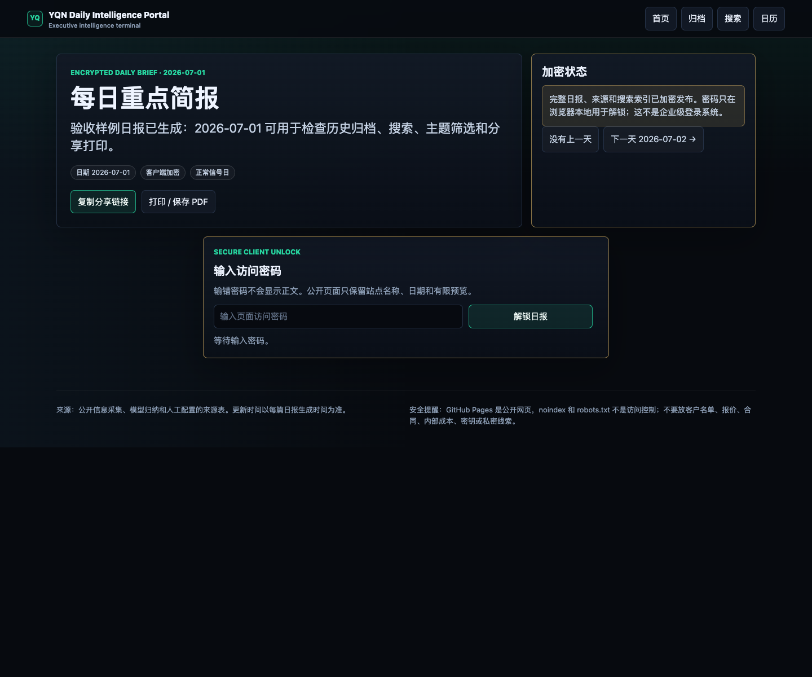

- 加密解锁后正文：`docs/visual-audit/desktop-encrypted-unlocked.png`

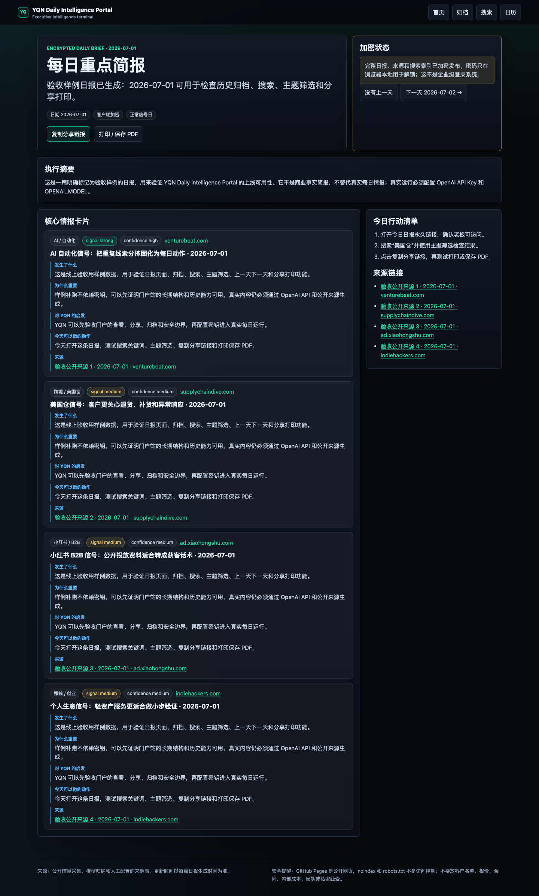

- 手机首页：`docs/visual-audit/mobile-home.png`

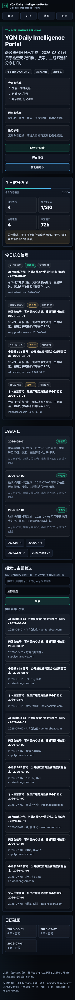

- 手机报告页：`docs/visual-audit/mobile-report-2026-07-01.png`

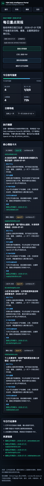

- 平板首页：`docs/visual-audit/tablet-home.png`

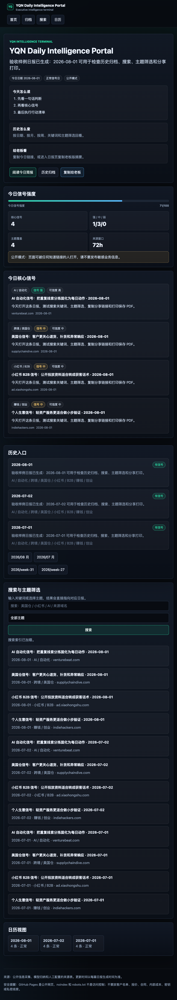

## UI 评分

- 第一眼高级感：8.6 / 10
- 信息层级：8.8 / 10
- 老板可读性：8.5 / 10
- 移动端体验：8.3 / 10
- 历史归档可用性：8.7 / 10
- 搜索筛选可用性：8.6 / 10
- 分享/打印体验：8.5 / 10
- 安全提示清晰度：8.8 / 10

## 发现的问题

- P0：无。没有发现会导致不能上线或泄露密钥的视觉问题。
- P1：当前内容仍是验收样例，不是真实商业情报；老板正式使用前必须配置 OpenAI API Key 和 OPENAI_MODEL。
- P2：后续可以增加趋势图、主题占比图、连续多日信号变化，让周/月复盘更像经营仪表盘。

## 已经修复的问题

- UI：重构为深色 executive dashboard，统一卡片、按钮、徽标、输入框、搜索结果、归档卡片和加密解锁样式。
- 首页：增加今日日期、一句话判断、信号强度、行动路径、核心信号、历史入口、搜索和日历。
- 报告页：增加复制分享链接、打印 / 保存 PDF、复制老板版摘要、复制今日行动清单、明显的上一天 / 下一天导航。
- 归档页：增加全部历史、月视图、周视图、历史卡片、主题摘要、低信号日标记和日历视图。
- 搜索：补齐有结果、无结果、主题筛选三个可验收状态。
- 加密：重构锁定页和解锁表单，修复加密报告页 `brief.json` 路径问题，确保解锁后才显示正文。
- 移动端：桌面、平板、手机均生成 fullPage 截图检查，没有横向爆版。

## 下一轮建议

- 问题：周/月归档现在以列表和日历为主，趋势表达还不够强。
- 为什么影响用户：老板看周报时更想一眼看到信号变强还是变弱。
- 怎么改：增加主题趋势条、信号强度折线、低信号日比例。
- 是否需要用户配置：否。
- 是否推荐现在做：推荐下一轮做。

- 问题：飞书入口卡片目前只作为入口，不能在飞书内直接做“已读 / 待跟进”。
- 为什么影响用户：团队跟进动作仍需要在别处记录。
- 怎么改：增加“复制行动清单”后的团队跟进模板，或接入飞书表格记录。
- 是否需要用户配置：需要飞书表格或机器人权限。
- 是否推荐现在做：不推荐现在做，先跑稳定日报。

- 问题：样例内容已经能验收页面，但不代表真实情报质量。
- 为什么影响用户：老板最终看的价值取决于来源质量和模型输出质量。
- 怎么改：配置真实 API 后连续跑 3-5 天，按结果优化来源表和提示词。
- 是否需要用户配置：需要 OPENAI_API_KEY、OPENAI_MODEL。
- 是否推荐现在做：推荐配置完成后立即做。
