# 视觉验收包

## 当前结论

- UI 状态：合格
- 是否达到老板可分享标准：是
- 是否达到每日自用标准：是
- 是否达到增长作战台标准：是
- 最大问题：真实 AI 日报和飞书通知仍依赖用户配置 OpenAI API Key、OPENAI_MODEL 和飞书 webhook。
- 最大改进：V3 已从“日报页面”升级为“YQN 增长作战台”，包含管理层摘要、MQL 质量、组织缺口、内容实验、个人日报、历史归档、搜索、安全状态和可视化交付包。

## 五维验收

1. 傻瓜式操作：
- 得分：9 / 10
- 依据：首页首屏有“先看管理层摘要 / 阅读今日日报 / 查历史归档 / 复制老板版摘要”，并有“今天先看这 3 件事”。
- 还差什么：真实飞书卡片接通后，可进一步把入口路径缩短到一次点击。

2. 信息架构：
- 得分：9 / 10
- 依据：管理层摘要、MQL 质量、组织缺口、内容实验、个人日报、历史归档、搜索、安全状态已经分区清楚。
- 还差什么：后续可把 MQL 指标接入真实线索表，而不是由日报信号推导。

3. 视觉设计：
- 得分：8.7 / 10
- 依据：深色底、YQN 蓝、金黄色点缀、航线/信号视觉隐喻、统一卡片和按钮体系已经落地。
- 还差什么：后续可以增加轻量趋势图，让周/月复盘更像经营仪表盘。

4. 老板可读性：
- 得分：9 / 10
- 依据：新增 `/executive/` 管理层摘要页，30 秒内能看到一句话判断、MQL 质量、风险、跨部门动作和今日 3 件事。
- 还差什么：真实数据接入后，需要把“需要老板拍板”的事项从规则推导升级为明确业务字段。

5. 长期使用体验：
- 得分：8.8 / 10
- 依据：按日期、按月、按周、搜索、主题筛选、报告上一天/下一天、打印 PDF、加密解锁、移动端均已覆盖。
- 还差什么：报告累计多月后，建议增加趋势页和标签聚合页。

## 页面截图索引

### 全页面截图

- 首页：`docs/visual-audit/full-page/desktop-home.png`

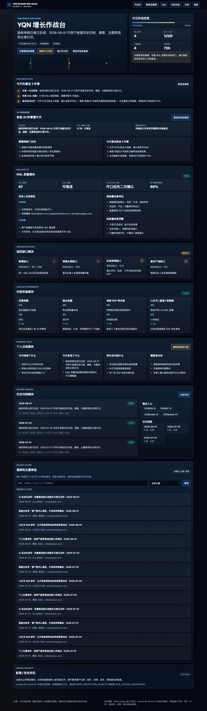

- 管理层摘要：`docs/visual-audit/full-page/desktop-executive.png`

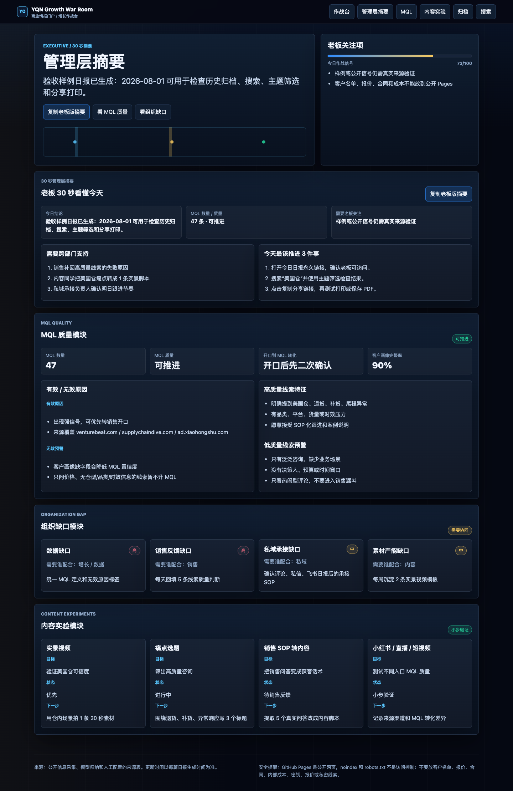

- MQL 质量：`docs/visual-audit/full-page/desktop-mql-quality.png`

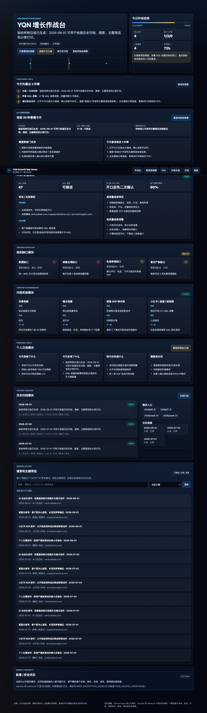

- 组织缺口：`docs/visual-audit/full-page/desktop-org-gap.png`

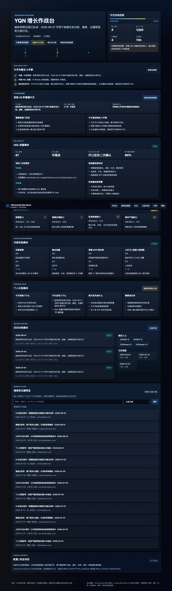

- 内容实验：`docs/visual-audit/full-page/desktop-content-experiment.png`

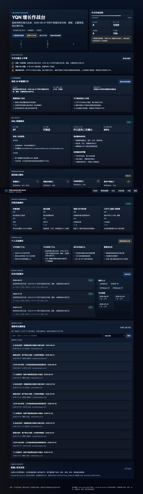

- 个人日报：`docs/visual-audit/full-page/desktop-personal-daily.png`

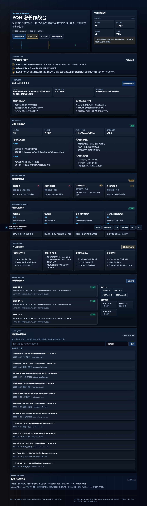

- 报告页：`docs/visual-audit/full-page/desktop-report-2026-07-01.png`

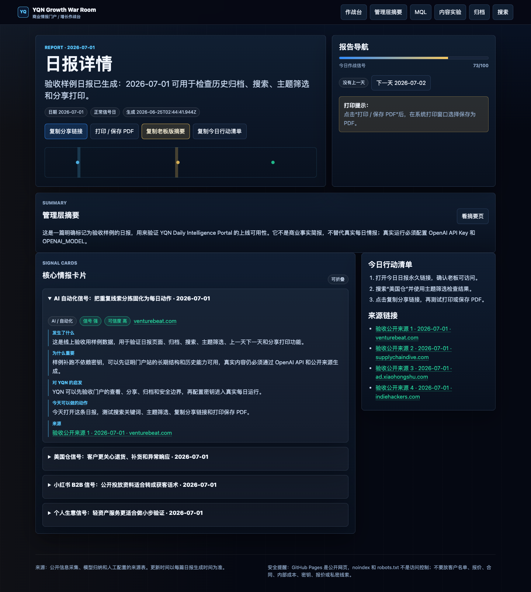

- 全部归档：`docs/visual-audit/full-page/desktop-archive.png`

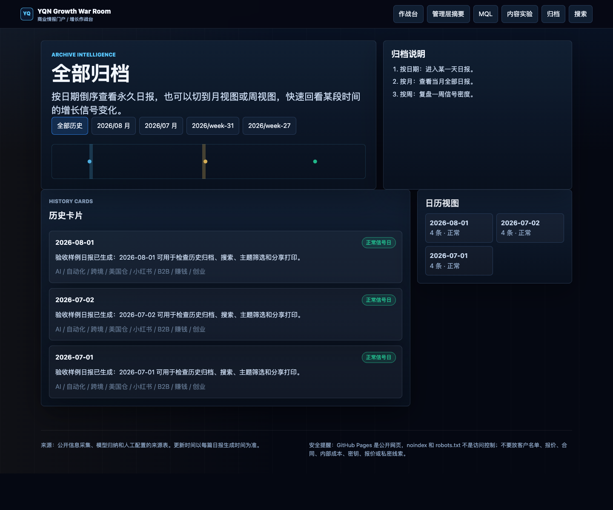

- 月归档：`docs/visual-audit/full-page/desktop-month-2026-07.png`

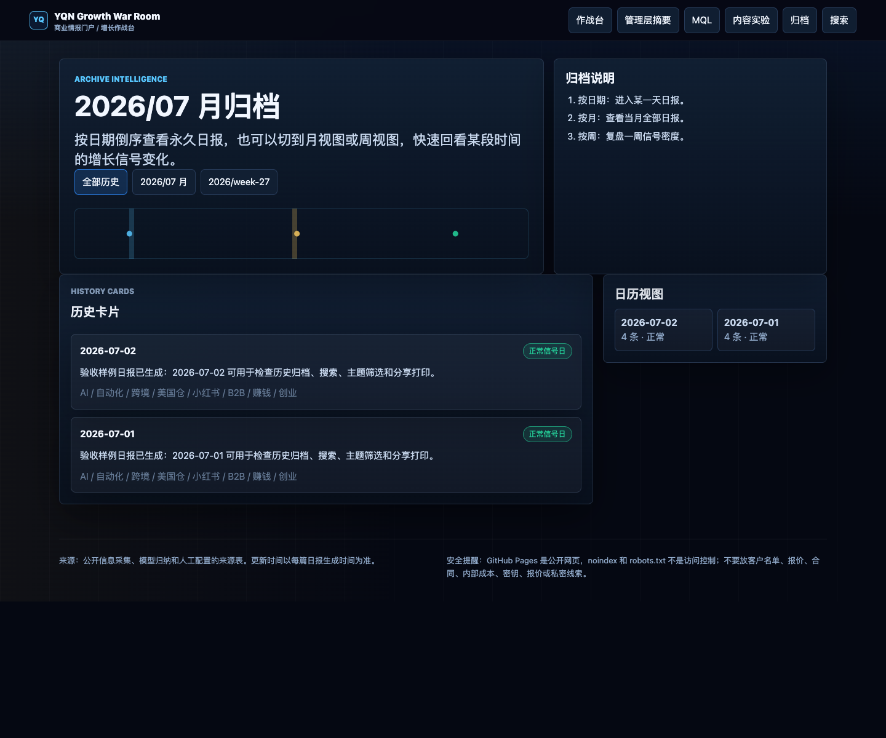

- 周归档：`docs/visual-audit/full-page/desktop-week-2026-W27.png`

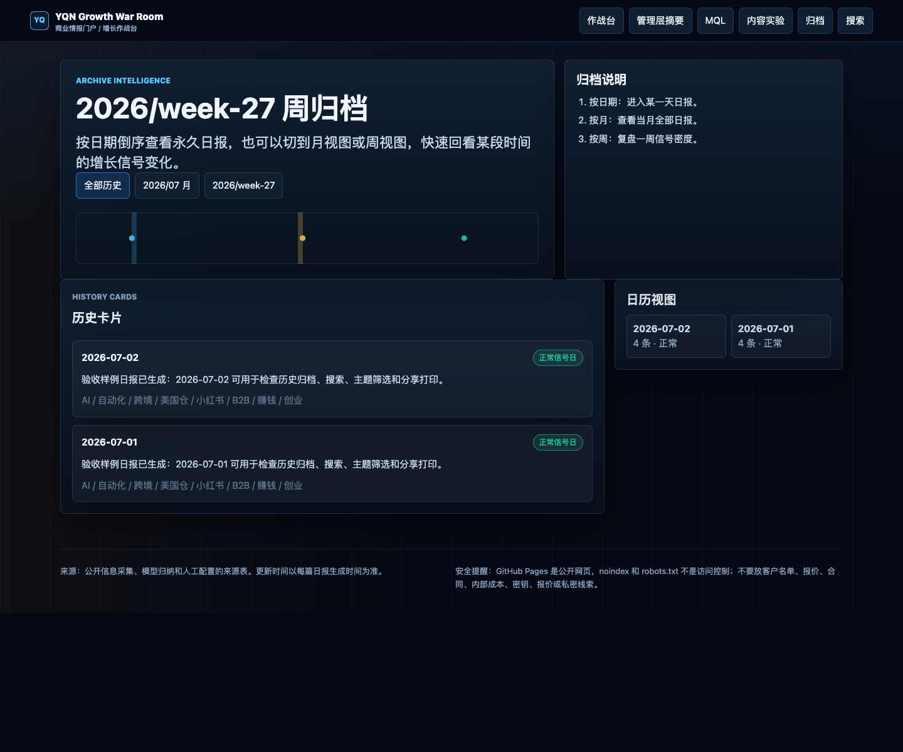

- 搜索有结果：`docs/visual-audit/full-page/desktop-search-results.png`

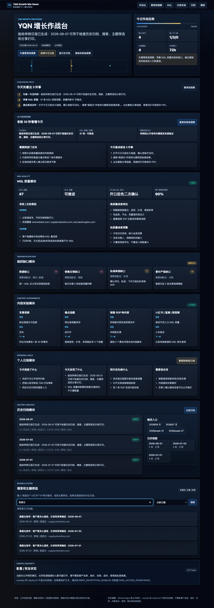

- 搜索无结果：`docs/visual-audit/full-page/desktop-search-empty.png`

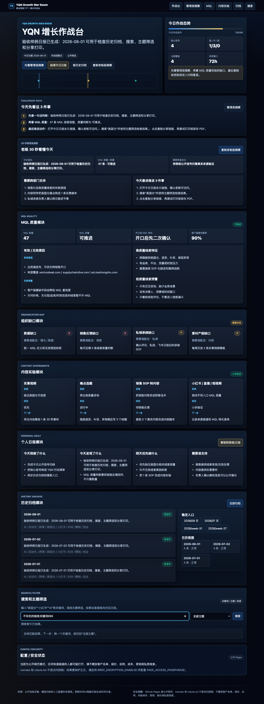

- 主题筛选：`docs/visual-audit/full-page/desktop-topic-filter.png`

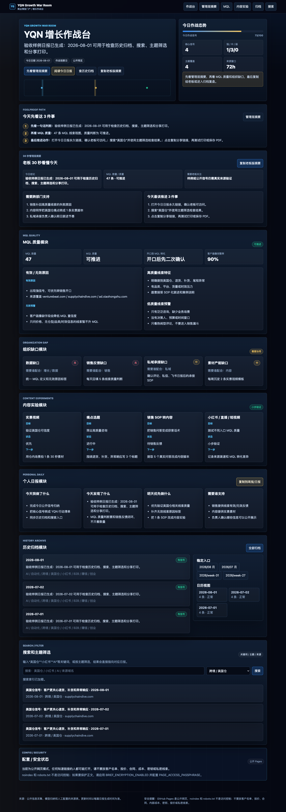

- 加密锁定：`docs/visual-audit/full-page/desktop-encrypted-locked.png`

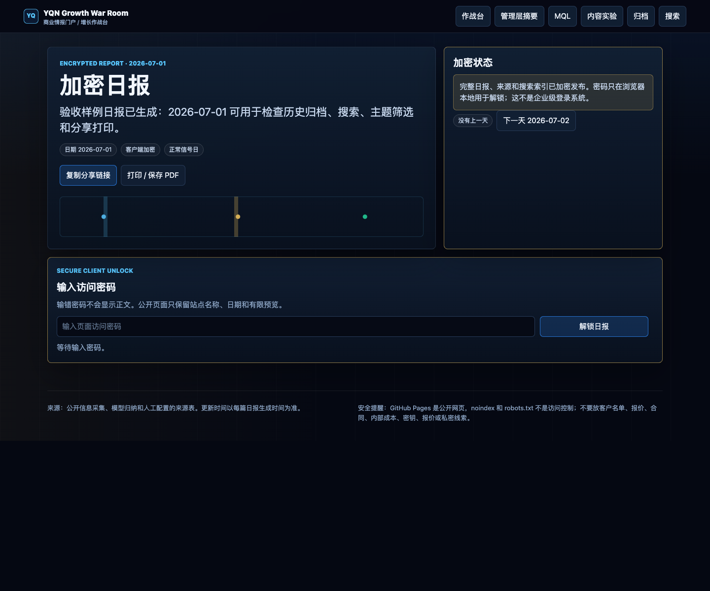

- 加密解锁后：`docs/visual-audit/full-page/desktop-encrypted-unlocked.png`

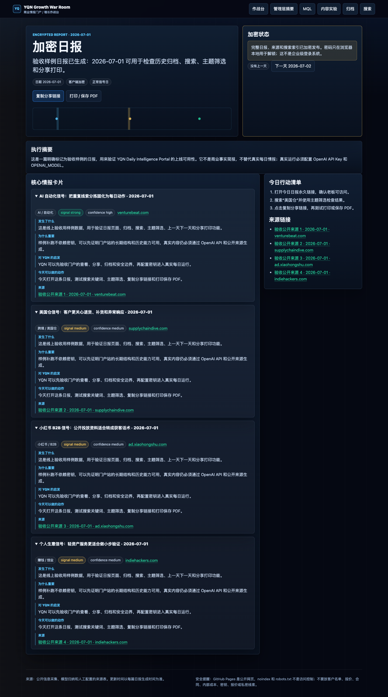

### 局部截图

- 首屏 Hero：`docs/visual-audit/sections/hero-command-center.png`
- 今天先看这 3 件事：`docs/visual-audit/sections/today-top-three.png`
- 管理层摘要卡片：`docs/visual-audit/sections/executive-summary-card.png`
- MQL 质量卡片：`docs/visual-audit/sections/mql-quality-card.png`
- 组织缺口卡片：`docs/visual-audit/sections/org-gap-card.png`
- 内容实验卡片：`docs/visual-audit/sections/content-experiment-card.png`
- 个人日报卡片：`docs/visual-audit/sections/personal-daily-card.png`
- 历史归档模块：`docs/visual-audit/sections/history-archive-module.png`
- 搜索模块：`docs/visual-audit/sections/search-module.png`
- 日历模块：`docs/visual-audit/sections/calendar-module.png`
- 报告页单条情报卡片：`docs/visual-audit/sections/report-card.png`
- 复制按钮区域：`docs/visual-audit/sections/copy-buttons.png`
- 打印 PDF 区域：`docs/visual-audit/sections/print-pdf-area.png`
- 加密解锁区域：`docs/visual-audit/sections/encryption-unlock-area.png`
- 配置状态区域：`docs/visual-audit/sections/config-status-module.png`
- 手机端顶部：`docs/visual-audit/sections/mobile-top.png`
- 手机端报告卡片：`docs/visual-audit/sections/mobile-report-card.png`

### 手机截图

- 手机首页：`docs/visual-audit/full-page/mobile-home.png`
- 手机报告页：`docs/visual-audit/full-page/mobile-report-2026-07-01.png`

### 录屏路径

- MP4：`docs/visual-audit/recordings/desktop-30s-operator-flow.mp4`
- WebM：`docs/visual-audit/recordings/desktop-30s-operator-flow.webm`

## P0/P1/P2 问题

- P0：无。没有发现阻断上线、密钥泄露或页面打不开的问题。
- P1：真实 AI 日报仍需用户配置 `OPENAI_API_KEY` 和 `OPENAI_MODEL`。
- P1：飞书通知仍需用户配置 `FEISHU_WEBHOOK_URL`。
- P2：MQL 指标当前由日报信号推导，后续建议接真实线索表。
- P2：周/月归档建议增加趋势图。

## 我已经修了什么

- 首页：重构为 YQN Growth War Room，增加作战台首屏和“今天先看这 3 件事”。
- 管理层摘要：新增 `/executive/`，包含 30 秒摘要、今日结论、MQL 判断、风险、跨部门动作、今日 3 件事。
- MQL 质量：新增 MQL 数量、质量、开口到 MQL 转化、客户画像完整率、有效/无效原因、高低质量线索判断。
- 组织缺口：新增数据、销售反馈、私域承接、素材产能缺口和责任协同。
- 内容实验：新增实景视频、痛点选题、销售 SOP 转内容、小红书/直播/短视频实验。
- 个人日报：新增今天做了什么、发现了什么、明天优先做什么、需要谁支持，并支持复制。
- 历史归档：保留并强化按日期、按月、按周、日历和历史卡片。
- 搜索：验证搜索有结果、搜索无结果、主题筛选状态。
- 移动端：生成手机首页、手机报告页和局部截图。
- 加密：保留锁定/解锁界面，并生成加密锁定和解锁后截图。
- 打印/PDF：报告页保留打印 / 保存 PDF 按钮，并单独截图。

## 下一轮建议

1. 问题：MQL 指标目前由日报信号推导。
- 为什么重要：老板最终关心真实线索质量，而不是页面推导指标。
- 怎么改：接入实际 MQL 表或每日手工导入 CSV，生成真实漏斗。
- 是否需要用户配置：需要提供数据表或导出文件。
- 是否推荐现在做：推荐作为下一轮最高优先级。

2. 问题：周/月归档还缺趋势图。
- 为什么重要：复盘时要看信号变化，而不是只看单篇日报。
- 怎么改：新增主题趋势、强信号比例、低信号日比例、MQL 质量趋势。
- 是否需要用户配置：不需要。
- 是否推荐现在做：推荐。

3. 问题：飞书卡片还只是入口。
- 为什么重要：团队协同需要“谁跟进、是否完成”的闭环。
- 怎么改：接入飞书表格或简单状态文件，记录每日行动完成情况。
- 是否需要用户配置：需要飞书表格或机器人权限。
- 是否推荐现在做：配置飞书 webhook 后再做。
